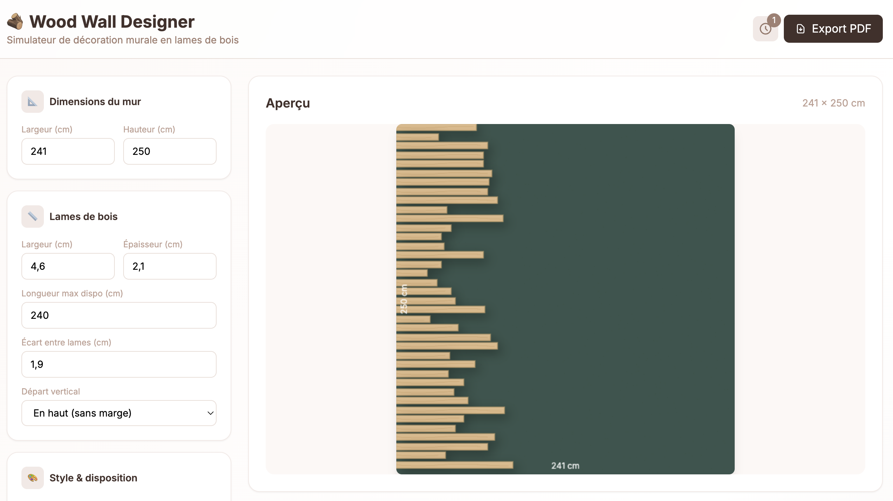

# Wood Wall Designer

Simulateur de mur décoratif en lames de bois. Configurez les dimensions, choisissez un motif et obtenez un plan de coupe optimisé.



## Fonctionnalités

- Configuration des dimensions du mur et des lames
- Plusieurs motifs disponibles (vague, pyramide, diagonal, etc.)
- Calcul automatique du nombre de lames à acheter
- Plan de coupe optimisé pour minimiser les chutes
- Export PDF
- Historique des simulations (localStorage)
- Mini-aperçu flottant lors du scroll

## Démo

[wood-wall.vercel.app](https://wood-wall.vercel.app)

## Technologies

- HTML / CSS / JavaScript
- Tailwind CSS
- jsPDF

## Utilisation locale

Ouvrir `index.html` dans un navigateur.

## Déploiement

```bash
npm run deploy
```

## Licence

MIT
